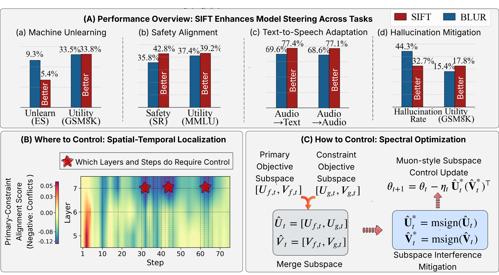

<div align='center'>


# Subspace Control: Turning Constrained Model Steering into Controllable Spectral Optimization

[]()
[](https://huggingface.co/collections/OPTML-Group/simnpo-unlearned-models-6721751fb02ab0e490ab0017)
[](https://github.com/OPTML-Group/SIFT/issues)

[](https://github.com/OPTML-Group/SIFT?tab=MIT-1-ov-file)
[](https://github.com/OPTML-Group/SIFT)
[](https://github.com/OPTML-Group/SIFT)
[](https://github.com/OPTML-Group/SIFT)

</div>

<table align="center">
  <tr>
    <td align="center"> 
       
      <br>
      <em style="font-size: 18px;">  <strong style="font-size: 18px;">Figure 1:</strong> Schematic overview of proposed subspace control framework, SIFT.</em>
    </td>
  </tr>
</table>


This is the official code repository for SIFT [Subspace Control: Turning Constrained Model Steering into Controllable Spectral Optimization]().

## News ##

:mega: Check out our [Arxiv version]() on subspace control for constrained model training!

## Abstract

Foundation models, such as large language models (LLMs), are powerful but often require customization before deployment to satisfy practical constraints such as safety, privacy, and task-specific requirements, leading to "constrained" optimization problems for model steering and adaptation. 
However, solving such problems remains largely underexplored and is particularly challenging due to interference between the primary objective and constraint objectives during optimization. 
In this paper, we propose a subspace control framework for constrained model training. Specifically, (i) we first analyze, from a model merging perspective, how spectral cross-task interference arises and show that it can be resolved via a one-shot solution that orthogonalizes the merged subspace; (ii) we establish a connection between this solution and gradient orthogonalization in the spectral optimizer Muon; and (iii) building on these insights, we introduce **SIFT** (spectral interference-free training), which leverages a localization scheme to selectively intervene during optimization, enabling controllable updates that mitigate objective–constraint conflicts. We evaluate SIFT across four representative applications: (a) machine unlearning, (b) safety alignment, (c) text-to-speech adaptation, and (d) hallucination mitigation. Compared to both control-based and control-free baselines, SIFT consistently achieves substantial and robust performance improvements across all tasks.

## Getting Started

This repository is organized into four task-specific modules:

- `unlearning`
- `safety`
- `speech`
- `hallucination`

### Unlearning

#### Environment Setup

```bash
cd unlearning
conda env create -f environment.yml
conda activate <env_name>
```

#### Usage

```bash
bash unlearn_sift_run.sh
```

### Safety

#### Environment Setup

```bash
cd safety
conda env create -f environment.yml
conda activate <env_name>
```

#### Usage

```bash
bash safety_sift_run.sh
```

### Speech

#### Environment Setup

```bash
cd speech
conda env create -f environment.yml
conda activate <env_name>
```

#### Usage

```bash
bash speech_sift_run.sh
```

### Hallucination

#### Environment Setup

```bash
cd hallucination
conda env create -f environment.yml
conda activate <env_name>
```

#### Usage

```bash
bash hallucination_sift_run.sh
```

## Download Models

To directly using our unlearned model, please refer to our HuggingFace Collection:

* [🤗OPTML-Group/SIFT-Models]()

## Contributors

* [Changsheng Wang](https://changshengwang.me/)
* [Yancheng Huang](https://bfdxy12138.github.io/)

## Cite This Work

```
Published Soon ! 
```

Any problem about the code please contact the wangc168@msu.edu directly!
